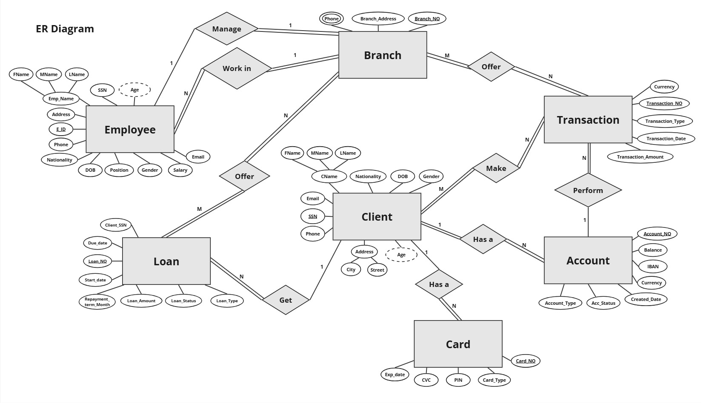
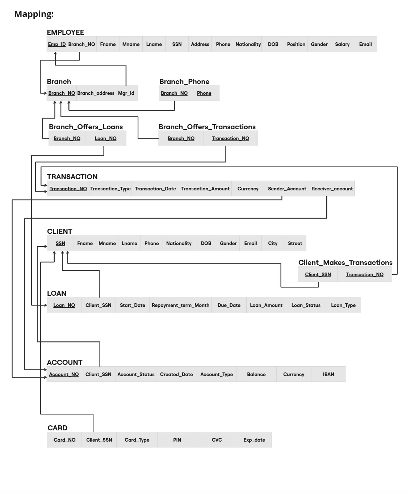
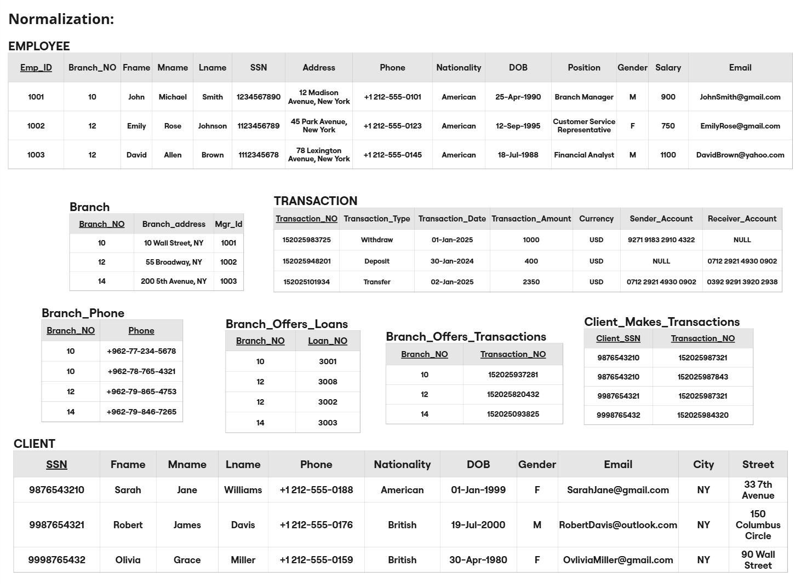
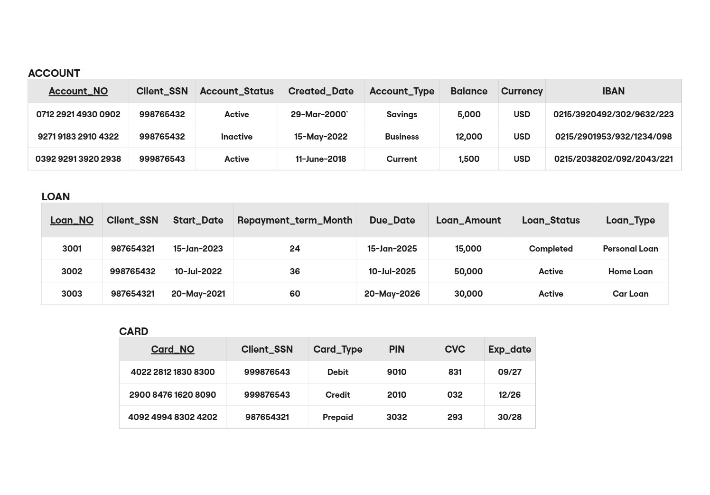

# Bank Database Design 

## Project Description
This project presents the design of a relational database for a bank system. It includes Entity-Relationship Diagram, Relational Mapping, and Normalization. The goal of this project is to solve the limitations of the traditional file-based systems, such as data redundancy, inconsistency, slow data retrieval, and limited security.  

The database consists of **seven main tables**: Employee, Client, Account, Transaction, Loan, Card, and Branch. In addition, **Three associative tables** are created from many-to-many relationships. There is also an **additional table** used to handle a multivalued attribute.

## Project Objectives
1. Design a clear ER diagram for a bank system
2. Convert the ER diagram to relational tables (mapping)
3. Apply normalization up to 3NF
4. Reduce redundancy and improve data consistency 
5. Implement the database using SQL

## Tools used
1. **Miro**
2. **SQL Developer**

## ER Diagram
The ER diagram illustrates the structure of a banking database system and how its main entities are related.  

The diagram includes:
- Seven entities representing the main components
- Nine relationships:
  - Three many-to-many relationships
  - Five one-to-many relationships
  - One one-to-one relationship

  

## Mapping 
The relational mapping shows how the ER diagram is converted into database tables.  

  

## Normalization
The design follows normalization rules up to 3NF.  

**🔴 Note: The data used in the normalization pictures are not real and its used for illustration purposes.**

  

## SQL Implementation
The database was implemented using **Oracle SQL**. 

The SQL script includes:
- Creation of all main entities:
  - Client
  - Account
  - Card
  - Loan
  - Transaction
  - Employee
  - Branch
- Creation of relationship tables to handle:
  - Many-to-many relationships:
    - Branch_Offers_Loans
    - Branch_Offers_Transactions
    - Client_Makes_Transactions
  - Multivalued attributes:
    - Branch_Phone
- Use of constraints such as:
  - PRIMARY KEY
  - FOREIGN KEY
  - NOT NULL
  - UNIQUE
  - CHECK
  - DEFAULT

The full SQL script is available in [BankDB.sql](BankDB.sql).

## Authors 
- [Ibrahim Rajou](https://github.com/IbrahimRajou)
- [Mahmoud Youssuf](https://github.com/MahmoudYoussuf)
